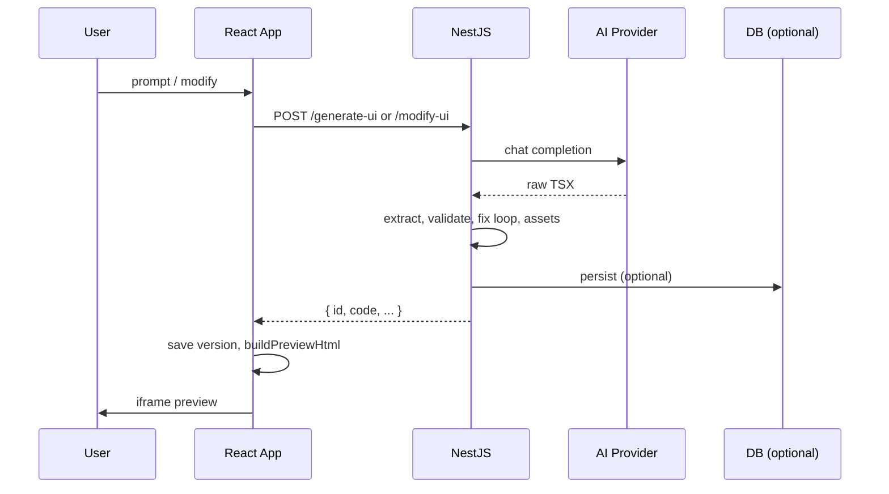

# Tech Debt

Technical gaps, security risks, and refactors for the AI UI Builder. For product-facing enhancements, see [FUTURE-FEATURES.md](./FUTURE-FEATURES.md).

---

## Flow & client

| Area | Current state | Target |
|------|---------------|--------|
| Request cancellation | Long AI calls cannot be aborted | `AbortController` on `fetch`; cancel in-flight Groq when user leaves or clicks Cancel |
| Rate limits | Groq `RateLimitError` → generic 502 | Show retry-after; briefly disable Generate |
| Offline | Generic network error | Detect offline; queue prompts for retry |
| Timeouts | No client `fetch` timeout | Align with server; distinguish timeout vs 502 |
| Debug route | `/debug` always available | Gate behind dev flag or exclude from production builds |

---

## Projects & history

Projects and version history live in **`localStorage`** (`frontend/src/utils/projectStorage.ts`). Nothing is persisted on the server.

**Debt:** client-only storage — no sync across devices, no server backup, ~5MB browser quota risk.

**Direction:** persist via API to a database (e.g. Postgres) with auth. Enables share links, search, and multi-user support (see [FUTURE-FEATURES.md](./FUTURE-FEATURES.md#projects--history)).

---

## Backend (NestJS)

| Area | Current state | Target |
|------|---------------|--------|
| AI provider | `AiService` is Groq-only | `AiProvider` interface + env-driven adapters (OpenAI, Anthropic, Ollama) |
| Module boundaries | Large `ai/utils/` folder | Split: `generation`, `validation`, `design-fix`, `assets` |
| Persistence | Stateless API | Optional `Generation` entity for server history and analytics |
| Idempotency | New UUID per request | `Idempotency-Key` header on double-submit |
| Configuration | `.env` without schema | Zod (or similar) validation at startup |
| Observability | `Logger` only | Structured logs, metrics (latency, tokens, fix-loop attempts) |
| Testing | Strong unit tests in `ai/utils/*` | E2E for `POST /generate-ui` and `POST /modify-ui` with mocked Groq |
| Large payloads | `currentCode` has min length, no max | `@MaxLength` (~100KB); consider diff-based modify |
| Documentation | Root `README.md` outdated vs implementation | Sync with projects, modify, fix loop, preview runtime |

---

## Frontend (React)

| Area | Current state | Target |
|------|---------------|--------|
| State | `useBuilderState` (~270 lines) | Split into `useProjects`, `useGeneration`, `usePreview` or small store |
| API layer | `generateUiApi.ts` | Retry with backoff for 502/503; shared client |
| Preview runtime | Large inline + IIFE bundles | Versioned runtime URLs; lazy-load Recharts/Three when unused |
| Types | `GeneratedUi` duplicated with backend | Shared `packages/types` or OpenAPI-generated client |
| Routing | Manual `usePathname` | React Router if more routes are added |
| Build | Preview IIFEs built locally | CI: `build:preview-runtime` before deploy; artifact size budget |

---

## Cross-cutting

| Area | Current state | Target |
|------|---------------|--------|
| Monorepo | Separate `frontend/` and `backend/` | npm workspaces or Turborepo; shared types |
| Deployment | Two-terminal dev | Docker Compose; prod: API + CDN static UI |
| CI/CD | Not in repo | GitHub Actions: lint, test, build both apps |
| Feature flags | None | Env flags for Pexels, fix loop, experimental backgrounds |
| Validation parity | Backend `validate-ui-code.ts` vs lighter `buildPreviewHtml` | Shared validation package or same AST checks in preview |
| Health | `GET /` only | `GET /health` with provider connectivity check |

### Target data flow

---

## Security

### Secrets & configuration

| Risk | Mitigation |
|------|------------|
| API keys in `backend/.env` | Secret manager in prod; pre-commit scan for `gsk_`, `sk-` |
| Frontend env | No secrets in `VITE_*`; document in `.env.example` |
| CORS | Explicit allowlist per environment |

### API abuse

| Risk | Mitigation |
|------|------------|
| Unauthenticated `POST` endpoints | JWT / API keys; `@nestjs/throttler` per IP or user |
| Cost amplification (fix loop + Pexels) | Per-user quotas; configurable max fix attempts; circuit breaker |
| Prompt injection | Harden system prompts; never execute user code on server |
| Large body DoS | `@MaxLength` on `currentCode`; proxy request size limit |

### Untrusted preview code

| Risk | Mitigation |
|------|------------|
| XSS | Keep iframe `sandbox` without `allow-same-origin`; CSP inside iframe |
| CDN supply chain | Pin versions; self-host scripts; SRI hashes |
| Network from iframe | CSP `connect-src 'none'`; `img-src` allowlist |
| `getUserMedia` in ReactBits | Do not expose in production preview globals |
| Babel in browser | Acceptable for demo; prod: server compile (esbuild/swc) |
| Regex-only validation | AST denylist for `import`, `fetch`, `window.open`, dynamic handlers |

### Privacy

- Avoid logging full prompts in production; redact PII
- Document Pexels attribution and terms
- GDPR: export/delete when accounts exist

---

## Suggested priority

| Priority | Items |
|----------|--------|
| **P0** | Rate limiting, `currentCode` max length, CDN pinning / self-host, secret scanning |
| **P1** | AI provider abstraction, env validation schema, E2E tests, README sync |
| **P2** | Shared types package, DB persistence, Docker Compose, validation parity |
| **P3** | Observability, monorepo tooling, server-side preview compile |

---

## Code references

| Topic | Location |
|-------|----------|
| API endpoints | `backend/src/generate-ui/generate-ui.controller.ts` |
| AI pipeline | `backend/src/ai/ai.service.ts`, `backend/src/ai/utils/*` |
| Code validation | `backend/src/ai/utils/validate-ui-code.ts` |
| Preview iframe | `frontend/src/organisms/PreviewFrame/PreviewFrame.tsx` |
| Preview HTML | `frontend/src/utils/buildPreviewHtml.ts` |
| Project state | `frontend/src/hooks/useBuilderState.ts` |
| Persistence | `frontend/src/utils/projectStorage.ts` |

---

## Related docs

- [IMPROVEMENTS.md](./IMPROVEMENTS.md) — overview and index
- [FUTURE-FEATURES.md](./FUTURE-FEATURES.md) — product roadmap
- [docs/Frontend-README.md](./docs/Frontend-README.md) — frontend architecture
- [docs/Backend-README.md](./docs/Backend-README.md) — backend architecture
- [Challenge.md](./Challenge.md) — requirements
